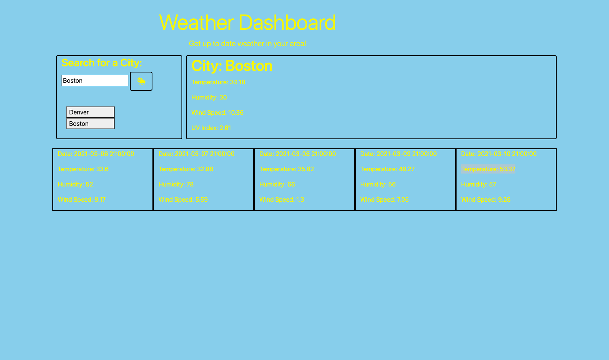

# Weather-Dashboard

## Description and Purpose of Work

--Created a dynamic weather dashboard from scratch that allows users to search a city and get the current day's forecast as well as a 5-day forecast. 
--The data is fetched from APIs from OpenWeatherMap.org
--Once a user has searched for a city it saves the city to local storage and allows the user to recall the information for that city. Previous searches must be cleared through local storage.

### Third-Party Libraries and Technologies Used

--Bootstrap
--jQuery
--Font Awesome
--OpenWeatherMap.org
